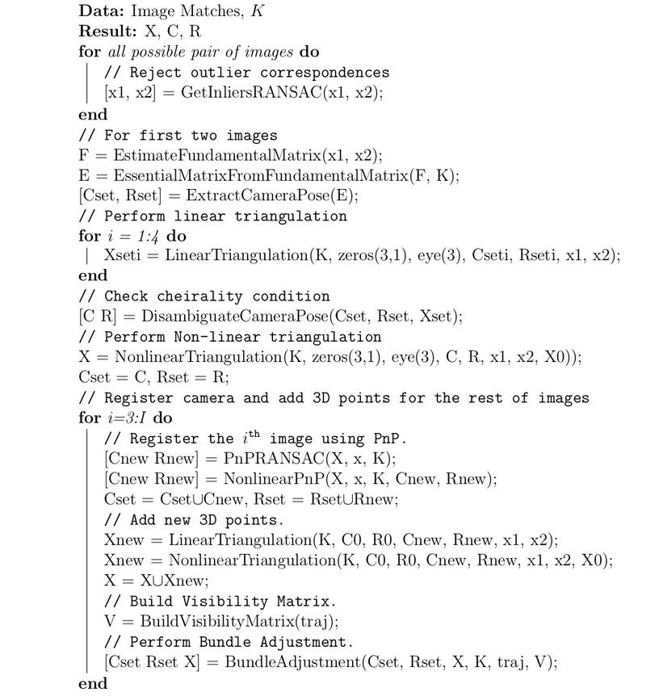
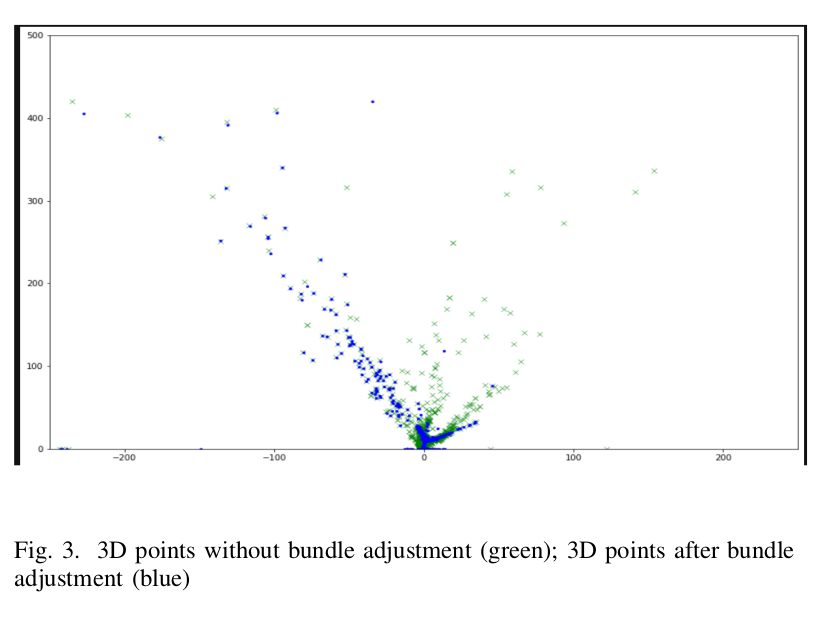

# Structure from Motion: Classical Approach
Python solution for [project 3: CMSC733 Computer vision course](https://cmsc733.github.io/2019/proj/p3/).
## Introduction
In this project, we reconstructed a 3D scene and simultaneously obtained the camera poses with respect to the scene,
with a given set of 6 images from a monocular camera and
their feature point correspondences. Following are the steps involved:
* Feature detection and finding correspondences
* Estimating Fundamental Matrix
* Essential Matrix and solving for camera poses
* Linear Triangulation and recovering correct pose
* Non Linear Triangulation
* Linear PnP, RANSAC and Non linear optimization
* Bundle Adjustment

Please refer the [report](https://github.com/sakshikakde/SFM/blob/master/Report-compressed.pdf) for detailed steps.


## How to run the code
- Change the directory to the folder where Wrapper.py is located. Eg.     
```
cd ./Code 
```

- Run the .py file using the following command:    
```
python3 Wrapper.py --DataPath ./Data/
```

## Parameters
- `--DataPath`: the path where the data is stored
- `--savepath`: the path to folder where the output will be saved
- `--BA`: True-If we want to use bundle adjustment

## Pipeline Details:

- First We perform feature matching between two consecutive frames and estimate a robust `EssentialMatrix` using RANSAC and also retain the inlier feature correspondences. refer `GetInliersRANSAC`, `EstimateFundamentalMatrix`, `EssentialMatrixfromFundamentalMatrix` for these functions. 
- Decompose the EssentialMatrix to compute 4 mathematically possible camera poses, and select the correct pose. For this, we compute the 3D points for every camera pose by triangulation and select the pose that satisifies the cheirality constraint. refer `LinearTriangulation` and `DisambiguateCameraPose`. 
- After computing the correct initial pose of the camera, we can keep constructing the point cloud and register the camera poses simultaneously. For this, we can use the 3D points and next set of feature matches to compute the next camera pose using PnP. This is done by fitting the model by RANSAC and refining the estimates using reprojection error cost function. `LinearPnP`, `PnPRansac`, `NonLinearPnP`, 
- We can repeat the camera pose 3D point estimation as we add new images, while also refining the estimates globally by Bundle Adjustment procedure using the reprojection error as cost function. ref `Bundle Adjustment` for this.

`Wrapper` contains the entire pipeline as given below.

## Pipeline



## Result



